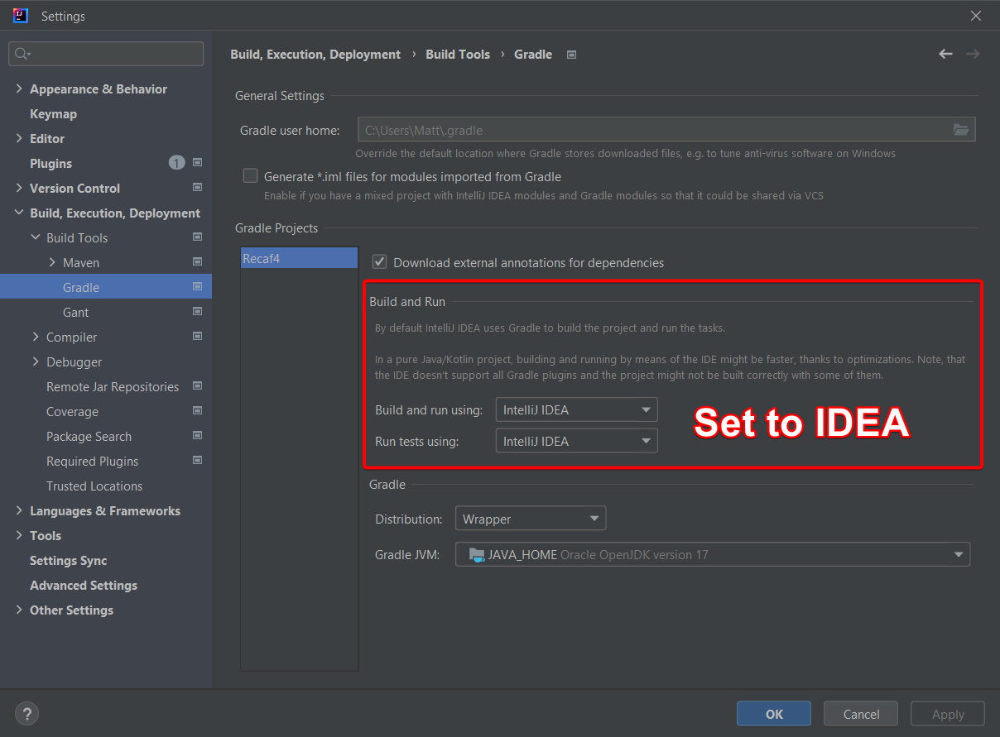

# Building

Recaf is structured as a multi-module gradle project. You can build an executable jar by running `gradlew build` in the project's root directory. Once that completes the file is located at `./recaf-ui/build/libs/recaf-ui-{VERSION}-all.jar`. 

## Including/excluding JavaFX in the build artifact

The file `recaf-ui-{VERSION}-all.jar` generated from the `build` task bundles JavaFX for the current platform you are building on *(IE, Windows / Linux / Mac)* and is intended to be ran with `java -jar recaf-ui-{VERSION}-all.jar`. 

If you do not wish to bundle JavaFX for your current platform use `gradlew build -Dskip_jfx_bundle=true`. When we build Recaf in the Github CI we enable this property so that it becomes the [Recaf Launcher's](https://github.com/Col-E/Recaf-Launcher/) responsibility to fetch the appropriate JavaFX artifacts. This way we can offer a single artifact that is usable by anyone, and if there are JavaFX updates we are not stuck with whatever version we would otherwise have bundled in the release artifact.

## Skipping tests when building

Generally, you shouldn't ever skip tests but if you must, you can run `gradlew assemble -x compileTestJava`. This skips compiling the unit test code and thus running any tests afterwards.

## Speeding up builds in IntelliJ

After you build Recaf at least once via `gradlew build` or `gradlew assemble` *(This step is required to generate the `RecafBuildConfig` class)* you can modify IntelliJ's settings for the project to drastically reduce the build time before running the application. Open your IntelliJ settings once the project is open and navigate to `Build, Execution, Deployment | Build Tools | Gradle`. Change the _"using"_ options to IDEA instead of Gradle. IntelliJ is usually smarter about recompiling only the necessary classes and thus it has less overhead to go through before running Recaf than using Gradle.

<figure><figcaption>
Changing the Gradle settings to build using IDEA instead of Gradle speeds things up a lot.
</figcaption></figure>

## Hotswapping code in IntelliJ

IntelliJ allows you to swap out the code of method bodies while running the application in the debugger. Normally this requires a project-wide build, but with the _"Single Hotswap"_ plugin, you can cut that down to only recompiling the affected class. This makes it very easy to iterate on a feature or bug fix without having to constantly restart Recaf.

<figure><figcaption>
The single-hotswap plugin for IntelliJ makes hot-reloading code much faster.
</figcaption></figure>