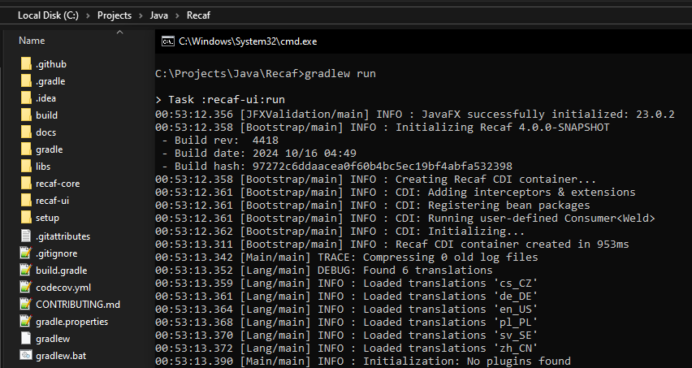
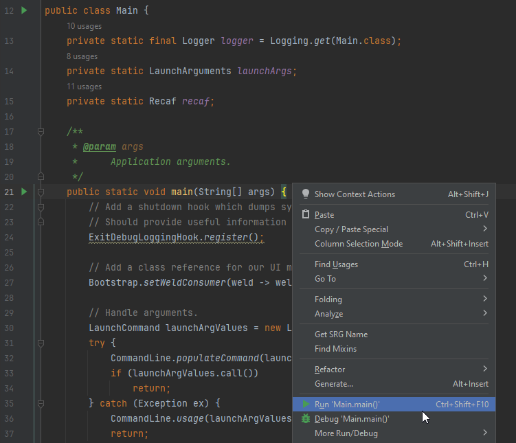

# Running

## Running Recaf

### Directly from Gradle / Terminal

<figure><figcaption>
Windows terminal using the "gradlew run" command to run Recaf.
</figcaption></figure>

Use `gradlew run`. This will build Recaf if you haven't already done so, then launch the UI. 

### Directly from IntelliJ

<figure><figcaption>
Context menu showing the 'run' option in the Recaf main class.
</figcaption></figure>

Create an application run configuration with `software.coley.recaf.Main` as the main class. You can do this simply by opening that class in IntelliJ, right clicking to open a context menu anywhere in the code, and selecting the _"Run"_ option with the green :arrow_forward: icon.

## Using Recaf as a command-line application

Recaf offers a number of command-line arguments _(outlined in [LaunchCommand](https://github.com/Col-E/Recaf/blob/master/recaf-core/src/main/java/software/coley/recaf/launch/LaunchCommand.java))_. The main intended use for these is automation of tasks and loading input at startup.

| Argument             | Description                                                  | Example                     |
| -------------------- | ------------------------------------------------------------ | --------------------------- |
| `-i` or `--input`    | Input to load into a workspace on startup.                   | `-i game.jar`               |
| `-s` or `--script`   | Script to run on startup.                                    | `-s LoadContent.java`       |
| `-h` or `--headless` | Flag to skip over initializing the UI. Should be paired with `-i` or `-s`. | `-h -s GenerateReport.java` |

When using `--input` the target file is any file that you want to open in Recaf _(The same way you would do so via the file menu, or by drag-and-drop)_.

When using `--script` the target file is a [Recaf script file](../plugins-and-scripts/scripts.md). 

- If you use `--input` with `--script` then the script will be run _after_ the workspace is loaded from the given input.

When using `--headless` it is assumed you are also going to use `--script` to automate some task without needing to launch any user interface.
