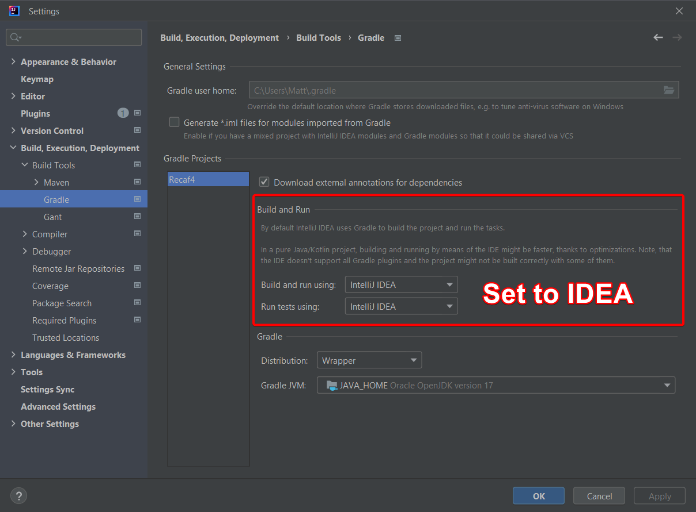

# Faster builds in IntelliJ

Open your IntelliJ settings once the project is open and navigate to `Build, Execution, Deployment | Build Tools | Gradle`. Change the _"using"_ options to IDEA instead of Gradle.

<figure><figcaption>
Changing the Gradle settings to build using IDEA instead of Gradle speeds things up a lot.
</figcaption></figure>

You will need to do `gradlew build` at least once before doing this to create a few files created by the build script.