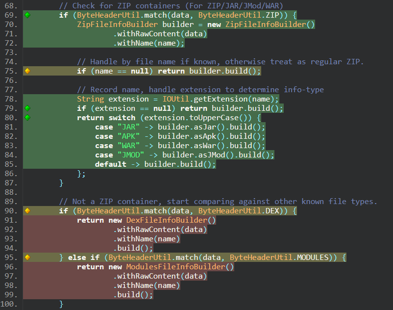

# How to improve test cases

Tests serve a variety of purposes.

1. Validate a feature does what it is supposed to.
2. Validate changes to a feature do not break its expected supported usage.

But there are some additional things you can write in your test cases that may be useful.

1. Validate a feature fails gracefully when given invalid inputs.
2. Validate a feature works, even when given as many edge-cases as possible, as opposed to _"common"_ input data.

How can you quickly tell what circumstances are covered by test cases though? The obvious option is to read the test cases and figure that out yourself. Ideally, the names of tests are descriptive enough to limit the amount of required reading for that. But there are additional options such as looking at test coverage and checking for branches that are not covered by tests.

## Checking code coverage

You can check what branches in the source are covered by running the tests via `gradlew test` and then build the coverage report via `gradlew buildJacocoAggregate`. All tests are configured to log coverage data via JaCoCo, and the `buildJacocoAggregate` task generates a report consolidating coverage from all tests in all modules into a single report. You can access the report in `./build/aggregate/`.

<figure><figcaption>
The main index page of the report shows a table of package's coverage
</figcaption></figure>

The main index page in the HTML report is a table showing which packages have the best code coverage. You can click on the packages to get data on each class in the package.

<figure><figcaption>
The table of a package's coverage shows per-class stats
</figcaption></figure>

Clicking on a class shows per-method coverage.

<figure><figcaption>
The table of a class's coverage shows per-method stats
</figcaption></figure>

Clicking on a method finally shows you the actual class source code, with information on coverage showed as line indicators. Clicking/hovering on them will reveal information like _"1 out of 2 branches covered"_.

<figure><figcaption>
Green means all branches are covered. Yellow means some were covered. Red means the code was missed.
</figcaption></figure>

Naturally the more code that is covered the better. So using these reports to figure out where coverage is missing from really helps.

## Checking code coverage online

If you want to see the current code coverage statistics and color-coded source without running the tests locally you can check out the latest [codecov.io/Col-E/Recaf](https://app.codecov.io/gh/Col-E/Recaf) report.
