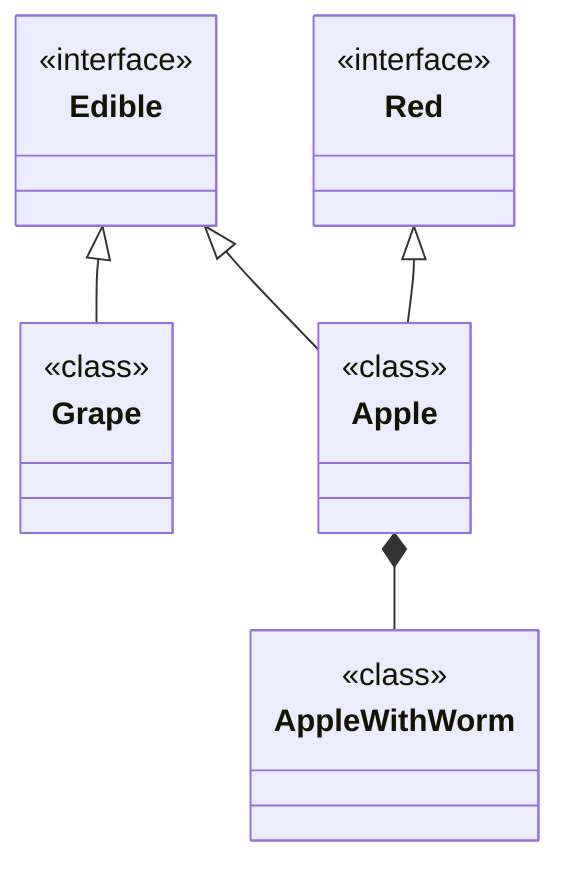
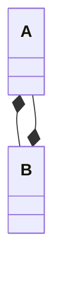
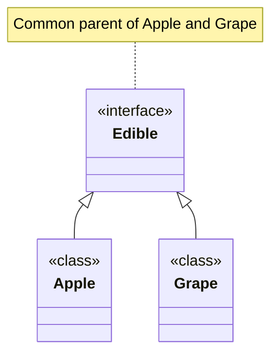

# InheritanceGraph

The `InheritanceGraph` allows you, for any given class, to see all of its parent types _(Those that it extends/implements)_ and its child types _(Those that extend/implement it)_.

## Parents and children

We will use the following classes for the following examples:

```java
interface Edible {}
interface Red {}
class Apple implements Edible, Red {}
class AppleWithWorm extends Apple {}
class Grape implements Edible {}
```



### Accessing parent types

You can access direct parents with `getParents()` which returns a `Set<InheritanceVertex>`, or `parents()` which returns a `Stream<InheritanceVertex>`. Direct parents include the class's super-type and any interfaces implemented directly by the class. For example `AppleWithWorm` will implement `Edible` and `Red` but these are not direct parents since those are not declared on the class definition.

You can access all parents with `getAllParents()` which returns a `Set<InheritanceVertex>`, or `allParents()` which returns a `Stream<InheritanceVertex>`.

```java
InheritanceVertex apple = graph.getVertex("Apple");
InheritanceVertex wormApple = graph.getVertex("AppleWithWorm");
InheritanceVertex red = graph.getVertex("Red");

// Get children as a set of graph vertices
//   The set 'appleParents' will have 2 elements: Edible, Red
//   The set 'wormAppleParents' will have 1 element: Apple
//   The set 'wormAppleAllParents' will have 3 element: Apple, Edible, Red
//   The set 'redParents' will be empty
Set<InheritanceVertex> appleParents = apple.getParents();
Set<InheritanceVertex> wormAppleParents = wormApple.getParents();
Set<InheritanceVertex> wormAppleAllParents = wormApple.getAllParents();
Set<InheritanceVertex> redParents = red.getParents();

// Alternative: Stream<InheritanceVertex>
wormApple.parents();
wormApple.allParents();
```

### Accessing child types

You can access direct children with `getChildren()` which returns a `Set<InheritanceVertex>`, or `children()` which returns a `Stream<InheritanceVertex>`. Direct children are just the reverse order of direct parents as described above.

You can access all children with `getAllChildren()` which returns a `Set<InheritanceVertex>`, or `allChildren()` which returns a `Stream<InheritanceVertex>`.

```java
InheritanceVertex apple = graph.getVertex("Apple");
InheritanceVertex wormApple = graph.getVertex("AppleWithWorm");
InheritanceVertex red = graph.getVertex("Red");

// Get children as a set of graph vertices
//   The set 'appleChildren' will have 1 element: AppleWithWorm
//   The set 'wormChildren' will be empty
//   The set 'redChildren' will have 1 element: Apple
//   The set 'redAllChildren' will have 2 elements: Apple, AppleWithWorm
Set<InheritanceVertex> appleChildren = apple.getChildren();
Set<InheritanceVertex> wormChildren = wormApple.getChildren();
Set<InheritanceVertex> redChildren = red.getChildren();
Set<InheritanceVertex> redAllChildren = red.getAllChildren();

// Alternative: Stream<InheritanceVertex>
apple.children();
apple.allChildren();
```

### Accessing complete type hierarchy _(parents and children)_

You can access direct children & parents with `getAllDirectVertices()` which combines the results of `getChildren()` and `getParents()`.

You can access all related vertices with `getFamily(boolean includeObject)` which will is an recursive calling of `getAllDirectVerticies()`. If you pass `true` it will include all types that are not edge-cases described below in the edge-case section. You will probably only ever pass `false` to `getFamily(...)`.

```java
// Direct will contain: Edible, Red, AppleWithWorm
Set<InheritanceVertex> appleDirects = apple.getAllDirectVertices();

// Family will contain: Edible, Red, AppleWithWorm, Apple (itself), Grape
//  - Grape will be included because of the shared parent Edible
Set<InheritanceVertex> appleFamily = apple.getFamily(false);
```

### Edge case: Classes without super-types

All classes must define a super-type. Each time you define a new class it will implictly extend `java/lang/Object` unless it is an `enum` which then it will extend `java/lang/Enum` which extends `java/lang/Object`. There are only a few exceptions to these rules.

Module classes, denoted by their name `module-info` do not define super-types. Their super-type index in the class file points to index `0` which is an edge case treated as `null` in this situation.

The `Object` class also has no super-type, for obvious enough reasons.

The inheritance graph accommodates for these edge cases. It may be useful information for you to know regardless.

### Edge case: Cyclic inheritance from obfuscators

Some obfuscators may create classes that are unused in the application logic, but exist solely to screw with analysis tools. Consider the following example:

```java
class A extends B {}
class B extends A {}
```



This code will not compile, but there is nothing stopping an obfuscator from creating these classes. If an analysis tool naively tries to find all parents of `A` it will look at `B` then `A` again, then `B` and you have yourself an infinite loop.

The inheritance graph tracks what types in a hierarchy have already been visited and short-circuits hierarchy searches in paths where it finds cycles.

## Getting the common type of two classes

You can get the common type of any two classes by passing their names to `InheritanceGraph`'s `getCommon(String a, String b)` method.

```java
// common will be 'Edible'
String common = graph.getCommon("Apple", "Grape");
```

