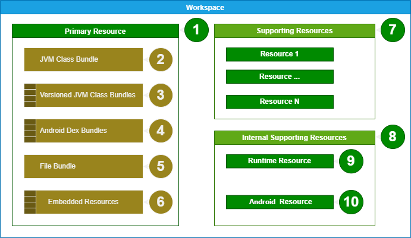

# The workspace

<figure><figcaption><p>A visual layout of the workspace model</p></figcaption></figure>

**Legend**

1. The primary resource is the input that is targeted for editing. If you drag and drop a single JAR file into Recaf, then this will represent that JAR file. The representation is broken down into pieces...
2. The JVM class bundle contains all the `.class` files in the input that are not treated specially by the JVM.
3. JAR files allow you to have multiple versions of the same class for different JVM versions via [_"Multi-release JAR"_](https://www.baeldung.com/java-multi-release-jar). This is a map of JVM version numbers to bundles of classes associated with that specific version.
4. Android's APK files may contain multiple containers of classes known as DEX files. This is a mapping of each DEX file to the classes contained within it.
5. The file bundle contains all other regular files that are not ZIP archives.
6. ZIP archives are represented as embedded resources, allowing a ZIP in a ZIP, or JAR in a JAR, to be navigable within Recaf.
7. Workspaces can have multiple inputs. These additional inputs can be used to enhance performance of some services such as inheritance graphing, recompilation, and SSVM virtualization just to name a few. These supporting resources are not intended to be editable and are just there to _"support"_ services as described before.
8. Recaf adds a few of its own supporting resources, but manages them separately from the supporting resources list.
9. The runtime resource allows Recaf to access classes in the current JVM process like `java.lang.String`.
10. The android resource allows Recaf to access classes in the Android runtime. It is automatically loaded when a resource with DEX files is detected.

## Creating workspaces

To create a `Workspace` instance you will almost always be using the `BasicWorkspace` implementation. You can pass along either:

* A single `WorkspaceResource` for the primary resource.
* A single `WorkspaceResource` for the primary resource, plus `Collection<WorkspaceResource>` for the supporting resources.

To create a `WorkspaceResource` you can use the [`ResourceImporter` service](../services/application-scoped-services/resourceimporter.md), which allows you to read content from a variety of inputs.

## Loading workspaces

There are multiple ways to load workspaces internally. Depending on your intent you'll want to do it differently.

For loading from `Path` values in a UI context, use [`PathLoadingManager`](../services/application-scoped-services/pathloadingmanager.md). It will handle loading the content from the path in a background thread, and gives you a simple consumer type to handle IO problems.

Otherwise, you can use [`WorkspaceManager`](../services/application-scoped-services/workspacemanager.md) directly to call `setCurrent(Workspace)`.

## Exporting workspaces

You can create an instance of `WorkspaceExportOptions` and configure them to suite your needs. The options allow you to change:

* The compression scheme of contents.&#x20;
  * `MATCH_ORIGINAL` which will only compress items if they were originally compressed when read.
  * `SMART` which will only compress items if compression yields a smaller output than a non-compressed item. Very small files may become larger with compression due to the overhead of the compression scheme's dictionary.
  * `ALWAYS` which always compresses items.
  * `NEVER` which never compresses items.
* The output type, being a file or directory.
* The path to write to.
* The option to bundle contents of supporting resources into the exported output.
* The option to create ZIP file directory entries, if the output type is `FILE`. This creates empty entries in the output of ZIP/JAR files detailing directory paths. Some tools may use this data, but its not required for most circumstances.

The configured options instance can be re-used to export contents with the same configuration multiple times. To export a workspace do `options.create()` to create a `WorkspaceExporter` which then allows you to pass a `Workspace` instance.

## Listeners

The [`WorkspaceManager`](../services/application-scoped-services/workspacemanager.md) allows you to register listeners for multiple workspace events.

* `WorkspaceOpenListener`: When a new workspace is opened within the manager.
* `WorkspaceCloseListener`: When a prior workspace is closed within the manager.
* `WorkspaceModificationListener`: When the active workspace's model is changed _(Supporting resource added/removed)_

When creating services and CDI enabled classes, you can annotate the class with `@AutoRegisterWorkspaceListeners` to automatically register and unregister the class based on what is necessary for the CDI scope.

## Accessing classes/files in the workspace

Classes and files reside within the `WorkspaceResource` items in a `Workspace`. You can access the resources directly like so:

```java
// Content the user intends to edit
WorkspaceResource resource = workspace.getPrimaryResource();

// Content to support editing, but is not editable
List<WorkspaceResource> resources = workspace.getSupportingResources();

// All content in the workspace, which may include internally managed 
// supporting resources if desired. Typically 'false'.
List<WorkspaceResource> resources = workspace.getAllResources(includeInternal);
```

As described in the workspace model above, resources have multiple _"bundles"_ that contain content. The groups exist to facilitate modeling a variety of potential input types that Recaf supports. Bundles that represent classes share a common type `ClassBundle` and then are broken down further into `JvmClassBundle` and `AndroidClassBundle` where relevant. Bundles that represent files are only ever `FileBundle`.

```java
// Contains JVM classes
JvmClassBundle bundle = resource.getJvmClassBundle();

// Contains JVM classes, grouped by the version of Java targeted by each class
NavigableMap<Integer, JvmClassBundle> bundles = resource.getVersionedJvmClassBundles();

// Contains Android classes, grouped by the name of each DEX file
Map<String, AndroidClassBundle> bundles = resource.getAndroidClassBundles();

// Contains files
FileBundle bundle = resource.getFileBundle();

// Contains files that represent archives, with a model of the archive contents
Map<String, WorkspaceFileResource> embeddedResources = resource.getEmbeddedResources();
```

These bundles are `Map<String, T>` and `Iterable<T>` where `T` is the content type.

```java
JvmClassBundle classBundle = resource.getJvmClassBundle();
FileBundle fileBundle = resource.getFileBundle();

// Get JVM class by name (remember to null check)
JvmClassInfo exampleClass = classBundle.get("com/example/Example");

// Looping over bundles
for (JvmClassInfo classInfo : classBundle)
    ...
for (FileInfo fileInfo : fileBundle)
    ...

// There are also stream operations to easily iterate over multiple bundles at once.
resource.classBundleStream()
         .flatMap(Bundle::stream)
         .forEach(classInfo -> {
             // All classes in all bundles that hold 'ClassInfo' values
             // including JvmClassBundle and AndroidClassBundle instances
         });
```

## Finding specific classes/files in the workspace

The `Workspace` interface defines some `find` operations allowing for simple name look-ups of classes and files.

| Method                                                                             | Usage                                                                                                                                                                                       |
| ---------------------------------------------------------------------------------- | ------------------------------------------------------------------------------------------------------------------------------------------------------------------------------------------- |
| `ClassPathNode findClass(String internalName)`                                     | Finds the first available `ClassInfo` by the given name, and wraps it in a `ClassPathNode`.                                                                                                 |
| `ClassPathNode findJvmClass(String internalName)`                                  | Finds the first available `JvmClassInfo` by the given name, and wraps it in a `ClassPathNode`.                                                                                              |
| `ClassPathNode findLatestVersionedJvmClass(String internalName)`                   | Finds the most up-to-date `JvmClassInfo` from all available versioned bundles, wrapping it in a `ClassPathNode`.                                                                            |
| `ClassPathNode findVersionedJvmClass(String internalName, int version)`            | Finds the first available `JvmClassInfo` matching the given version _(Floored to next available older version)_, and wraps it in a `ClassPathNode`                                          |
| `ClassPathNode findAndroidClass(String internalName)`                              | Finds the first available `AndroidClassInfo` by the given name, and wraps it in a `ClassPathNode`.                                                                                          |
| `DirectoryPathNode findPackage(String name)`                                       | Finds the first available `ClassInfo` defined in the given package, or any sub-package, then wraps the path in a `DirectoryPathNode`.                                                       |
| `SortedSet<ClassPathNode> findClasses(Predicate<ClassInfo> filter)`                | Collects all `ClassInfo` values in the workspace that match the given predicate, and wraps each in a `ClassPathNode`. The returned set ordering for paths is alphabetic order.              |
| `SortedSet<ClassPathNode> findJvmClasses(Predicate<JvmClassInfo> filter)`          | Collects all `JvmClassInfo` values in the workspace that match the given predicate, and wraps each in a `ClassPathNode`. The returned set ordering for paths is alphabetic order.           |
| `SortedSet<ClassPathNode> findVersionedJvmClasses(Predicate<JvmClassInfo> filter)` | Collects all versioned `JvmClassInfo` values in the workspace that match the given predicate, and wraps each in a `ClassPathNode`. The returned set ordering for paths is alphabetic order. |
| `SortedSet<ClassPathNode> findAndroidClasses(Predicate<AndroidClassInfo> filter)`  | Collects all `AndroidClassInfo` values in the workspace that match the given predicate, and wraps each in a `ClassPathNode`. The returned set ordering for paths is alphabetic order.       |
| `FilePathNode findFile(String filePath)`                                           | Finds any available `FileInfo` by the given name, and wraps it in a `FilePathNode`.                                                                                                         |
| `SortedSet<FilePathNode> findFiles(Predicate<FileInfo> filter)`                    | Collects all `FileInfo` values in the workspace that match the given predicate, and wraps each in a `FilePathNode`. The returned set ordering for paths is alphabetic order.                |
