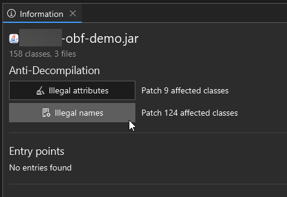
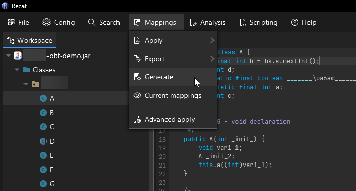
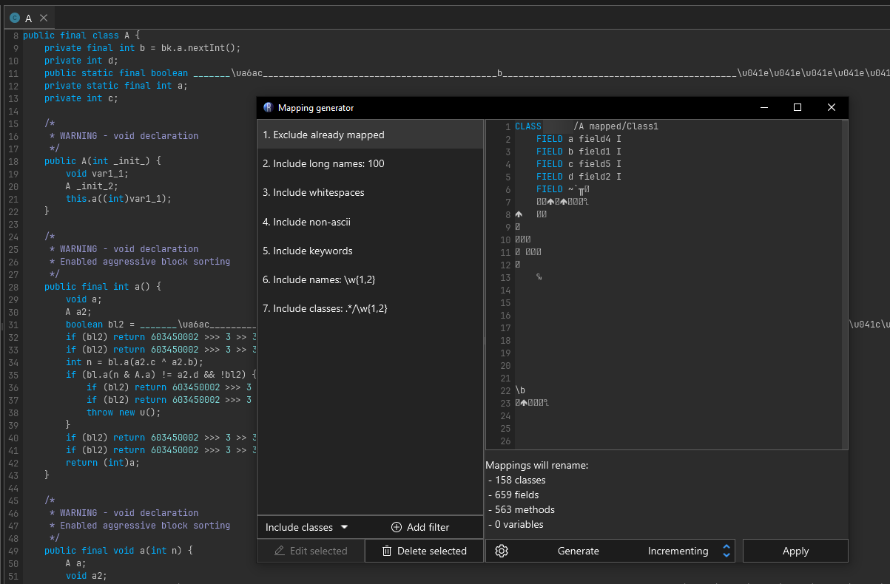
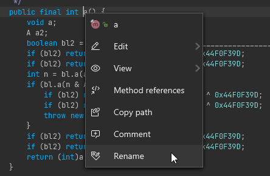
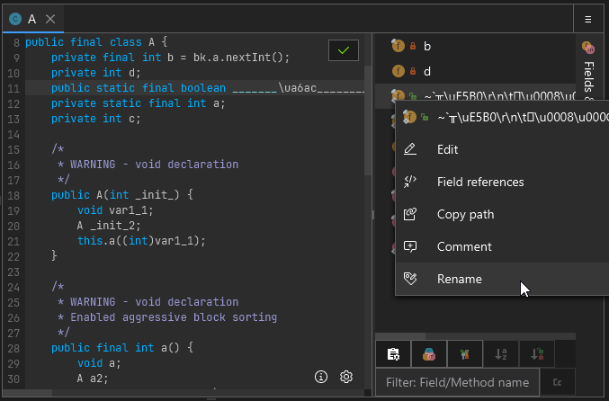
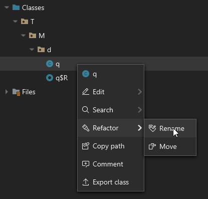
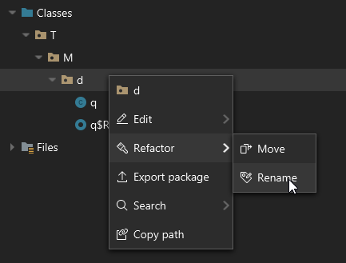

# Mapping

Recaf has multiple ways to clean up name obfuscation. There's automated processes like the mapping generator and applying obfuscation mappings, and then there's manual renaming where you rename items yourself one at a time.

## Automatic rule based renaming

When you first open a workspace Recaf does some analysis of the classes within it. If any classes with illegal names *(see reserved keywords, whitespace naming above)* the option to automatically rename those cases appears in the workspace summary/information display. Clicking the *"Illegal names"* button under *"Anti-Decompilation"* will open the mapping generator with the illegal names already pre-populated. You can hit *"Apply"* to automatically rename the listed classes, fields, and methods.

<figure><figcaption>
Recaf's workspace summary that displays when opening a file allows you to rename illegal identifiers with a single click
</figcaption></figure>

You can also open the mapping generator at any time by selecting *'Mapping > Generate'* in the menu bar.

<figure><figcaption>
The mapping generator is accessed from 'Mappings > Generate'
</figcaption></figure>

The mapping generator allows you to specify a series of rules for names to include and exclude. The following is an example that generally would cover most name obfuscation covered in this page:

- Include long names: 100
  - Reason: Most class names *(including the package name)* aren't actually that long, unless you're looking at something like [FizzBuzz Enterprise](https://github.com/EnterpriseQualityCoding/FizzBuzzEnterpriseEdition) or obfuscated code that makes very long names.
- Include whitespaces
  - Reason: Its impossible for unobfuscated code coming from Java source code to have whitespace characters in names. If any name has whitespace it is certainly something added through obfuscation.
- Include non-ascii
  - Reason: Its generally rare to see non-ascii characters in Java source. Its not impossible but given the rarity and how frequent obfuscators tend to use random high codepoint characters for their names, its generally a useful filter to include.
- Include keywords
  - Reason: Its impossible for unobfuscated code coming from Java source code to have class, field, or method names that are exact matches of reserved keywords.If any name equals a reserved keyword then it is certainly something added through obfuscation.
- Include names: Matches `\w{1,2}`
  - Reason: This is a regex that matches word *(`\w`)* characters 1 or 2 times. The idea is to match short names that you would see in a common ProGuard config.
- Include classes: Matches `.*/\w{1,2}`
  - Reason: This is a regex that matches any text up to a package separator *(`.*/`)*  and then word *(`\w`)* characters 1 or 2 times. The idea is to match short names that you would see in a common ProGuard config, but for classes in any package.

<figure>
The mapping generator will generically name classes, fields, and methods that match user-provided filters
</figcaption></figure>

## Manual renaming

Interacting with classes, fields, and methods allows you to rename them. When viewing decompiled code, rename on the name of the declared item. If the context can be resolved a context menu will appear and within this menu is the option to *"Rename"*. 

You can also rename classes, fields, and methods via `Alt + R` when the caret is on the declared item's name. This relies on the same context resolution, but allows you to rename items without using the mouse.

<figure><figcaption>
Right clicking on a class, field, or method will allow you to rename it
</figcaption></figure>

When context resolution fails *(which will happen in some forms of obfuscated code)* you can interact with fields and methods via the side panel aptly named *"Fields & Methods"*. In this sample I there is a field which is named a bunch of random characters, some which are not valid identifier characters. In this case the only way to interact with this field in the decompiler view is through this side menu.

<figure><figcaption>
On the right side of a decompiled class, you can also right click on fields and members in this list
</figcaption></figure>

Classes in the workspace tree can also be interacted with. Right clicking on them, or using the keybind `Alt + R` will allow you to rename them.

<figure><figcaption>
Right clicking on classes in the workspace tree also allows you to rename them
</figcaption></figure>

Classes can alternatively be moved. Moving differs slightly from renaming, it allows you to select a package in the workspace to move the class into. Technically at the end of the day it is still renaming, but the UX is more like what you would expect from the move operation in an IDE like IntelliJ.

<figure><figcaption>
Right clicking on packages lets you rename whole packages at a time
</figcaption></figure>