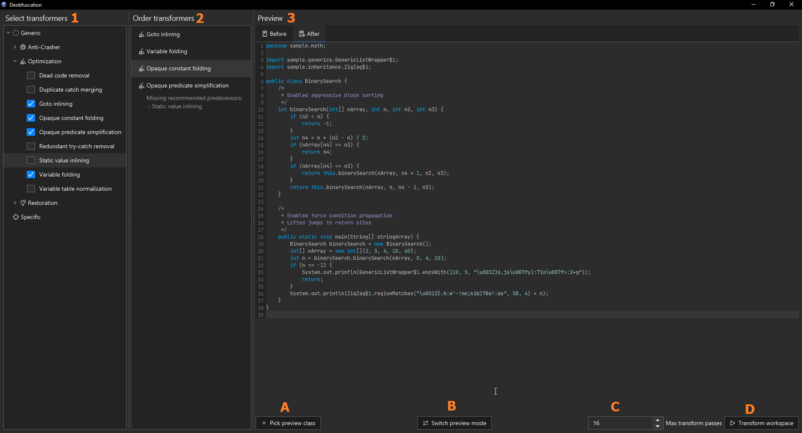

# Transformers

Recaf has a tool that matches and *"transforms"* obfuscated code patterns. It can be accessed via `Analysis > Deobfuscation`.

<figure><figcaption>
A screenshot of the deobfuscation window, annotated with labels to indicate different regions in the UI
</figcaption></figure>

From the image above, there are three columns:

1. The transformer selection column
2. The transformer order column
3. The preview column

The first column outlines the available transformers you can activate. Clicking the checkbox in the tree will activate it, and it will appear in the second column. The second column allows you to click and drag to move the transformers into different orders. Some transformers work best when they have other transformers run before/after them *(They will reccomend predecessors/successors when you when you activate them)* but getting the order perfect isn't strictly necessary. The last column contains the preview of what your transformers will do.

The preview column has several controls. From the image they are:

- **A**: The *"Pick preview class"* button
  - When clicked, you are prompted to select a class from the workspace.
  - The class you pick will be displayed in the preview space above, initially as decompiled code.
- **B**: The preview mode toggle button
  - When clicked, the output changes from being decompiled code into disassembled bytecode.
- **C**: The transformer max pass count
  - The maximum number of times to run transformers.
  - Some transformers like *constant folding*, when paired with *predicate simplification*, may require more passes to catch all possible patterns that can be optimized.
  - Classes only get processed up to the maximum pass count while transformers observe changes on a class. If the transformers are used on a class, and the class does not change as a result, then it will not be processed any further.
- **D**: The apply button
  - When clicked, the transformers you've selected are applied on every class in the workspace.

As an example, here is a short video detailing how this window can be used on a generic obfuscated input:

<video src="../../assets/deobfuscate-opaques.mp4" controls></video>

## Built-in transformers

TODO: Outline provided transformers with examples of what they match

## Custom transformers

Plugins can register their own transformers with the [`TransformationManager`](../../dev/services/transformationmanager.md).
