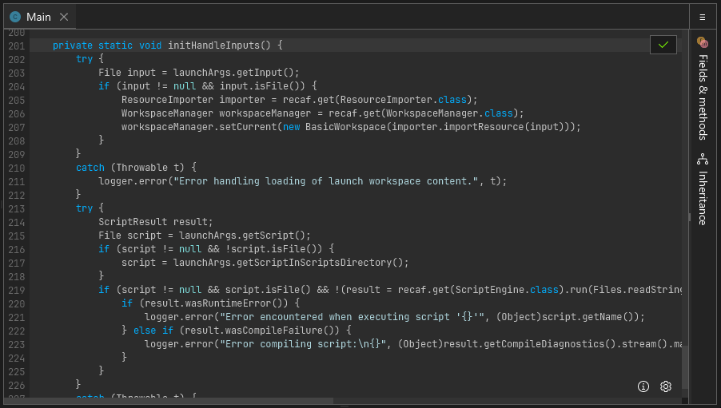
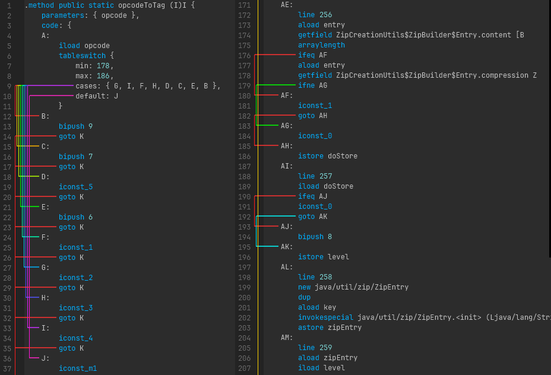
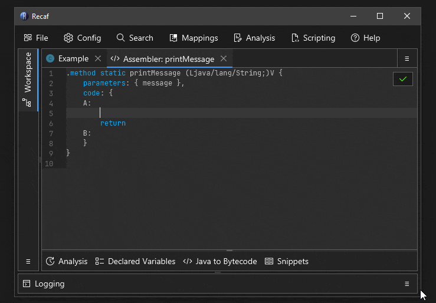

# Assembler

The assembler lets you edit the bytecode of Java classes in a low level format. It should be used whenever possible as opposed to recompiling decompiled code. Using the assembler is comparable to a surgeon using a scalpel, verses recompiling which is comparable to them using a sledgehammer for the same operation.

<figure><figcaption><p>A method open in the assembler, showing various method attributes and instructions.</p></figcaption></figure>

## How do I open the assembler?

The assembler for any class, field, or method can be accessed by right clicking on the _name_ of the class, field, or method and selecting _"Edit > Edit in assembler"_. If for some reason right clicking does not work _(which can occur when the context parser cannot understand obfuscated code)_ you can also right click on items in the _"Fields & Methods"_ tab shown on the right hand side of any open class.

<figure><figcaption><p>A short animation showing how to open the assembler.</p></figcaption></figure>

**Examples of where to click:**

```java
//   "Hello" will open the class assembler
//     |
//     V
class Hello {
    //    "message" will open the method assembler
    //       |
    //       V
    String message = "hi";

    // "foo" will open the method assembler
    //   |
    //   V
    void foo() {
        System.out.println(this.message);
    }
}
```

Additionally, you can right click on the class in the workspace explorer _(which is where the tree of classes are on the left)_ to open the class level assembler.

## I don't know much about bytecode, what now?

Ideally you can learn just enough to get by. Here are some relevant pages covering the basics of Java bytecode:

- [JVM Bytecode Instructions](../info/jvm-instructions.md): A list of all the JVM bytecode instructions and what they do. 
- [JVM Execution: Stack + Locals](../info/jvm-stack.md): A brief overview of how methods are executed, showing how the stack and local variable slots operate. 

After you read over these pages the additional tools and features offered by the assembler should be able to carry you the rest of the way to making your desired changes.

## Assembler Features

### Java to Bytecode

You can write snippets of Java code and the _Java to Bytecode_ tool will generate the equivalent bytecode. It uses the standard `javac` compiler behind the scenes, so whatever version of Java you run Recaf with dictates what features you have access to. But this means as long as you can fit your snippet into a continous block of code _(no separate method definitions)_ it'll be supported here. Though, there are other shortcuts included like the ability to  add `import` statements to the top.

<figure><video src="../../assets/method-assembler-java-to-bytecode.mp4" alt="Java to Bytecode showcase" controls="true" /><figcaption><p>Using the 'Java to Bytecode' feature to implement a toString() method.</p></figcaption></figure>

The editor is tied to whatever context the assembler is open with. For instance, if you open the assembler on a method that returns `String` _(or any Object type)_ it will expect that your snippet of Java code also eventually returns a `String` _(You can ignore it and keep the default `return null` if desired)_.

Another benefit of this context-sensitive compiler is that you can access information in that context. You will always have access to the current class's fields and methods. But when you open a method in the assembler you will also have access to the parameters and defined local variables of the method.

For instance, consider this method:
```java
double combine(double base, double power, double extra) {
	double tmp = Math.pow(base, power);
    return tmp + extra;
}
```
In this context you not only have access to the parameters `base`, `power`, and `extra`, but you also can access `tmp` in the Java to Bytecode tool. This means you could write something like `return tmp - extra`.

### Snippets

If you find yourself regularly using the _Java to Bytecode_ feature for the same kind of operation you may want to keep a copy of the results as a snippet. Snippets are just segments of code that you find useful for copy-pasting later.

<figure><video src="../../assets/method-assembler-snippets.mp4" alt="Code snippet showcase" controls="true" /><figcaption><p>Using the 'Snippets' feature to get the code for a simple `println`.</p></figcaption></figure>

Recaf comes with a few example snippets. They have comments in them outlining what the original source code equivalent is and then the bytecode that corresponds to that source:

- `for (int i = 0; i < 10; i++) someMethod();`
- `while (i >= 0) { someMethod(); i--; }`
- `if (b)  whenTrue(); else whenFalse();`
- `System.out.println("Hello");`
- `System.out.printf("hello %s\n", name);`

When you create your own snippet you are prompted to give it a name and description. Afterwards you can type out our desired code snippet in the editor and then press the save button to keep it.

### Analysis of stack/locals

While it is encouraged to read the [JVM Bytecode Instructions](jvm-instructions.md) and [execution](jvm-stack.md) pages, mentally keeping track of how things move around on the stack and are stored in local variables can be tedious. The _Analysis_ will do all of this for you. Contents of easily computed values _(primitives and Strings)_ will also show their current values based on where your caret/text position is at within the method assembler.

<figure><video src="../../assets/method-assembler-analyzer.mp4" alt="Stack/locals analyzer showcase" controls="true" /><figcaption><p>Using the 'Analysis' feature to observe how instructions work.</p></figcaption></figure>

### Control flow lines

Some instructions change the control flow of program exection. Remembering what label a jump goes to and scrolling to it _(or using `Control + F` to find it)_ is tedious. Instead, when you click on any label or any instruction that potentially manipulates control flow you will see where those instructions will lead to. To disambiguate which jumps go where, any time there are multiple control flow lines next to one another they will use a distinct color. Ihe color selection is based on a hue rotation, so something like a large `switch` statement will generate a rainbow.

<figure><figcaption><p>A series of lines between instructions and referenced labels.</p></figcaption></figure>

### Tab completion

The names of instructions and field/method references can be tab completed.

<figure><figcaption><p>A short animation showing how tab completion can be used to make writing bytecode faster.</p></figcaption></figure>
