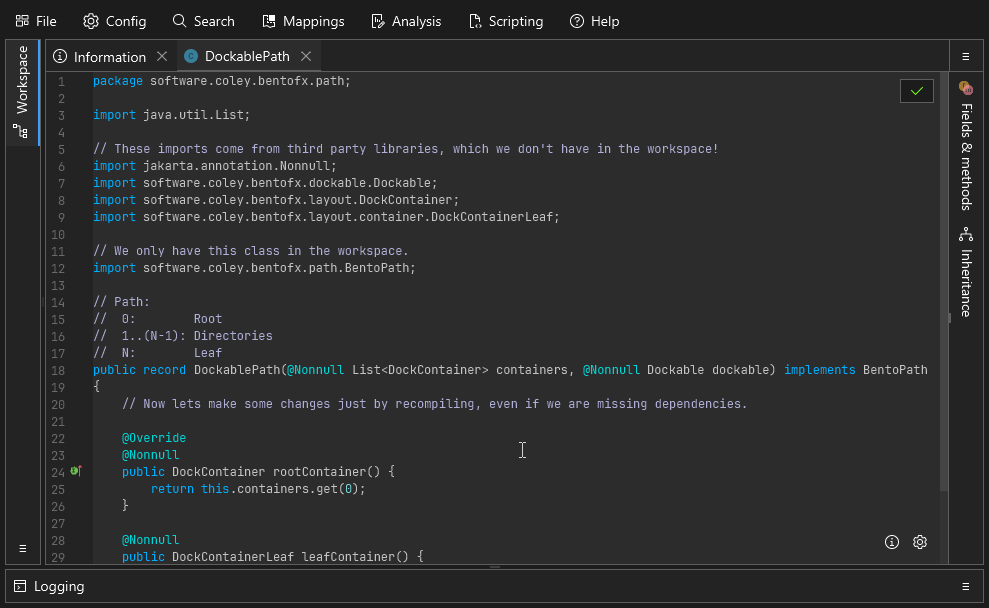
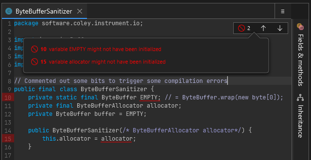
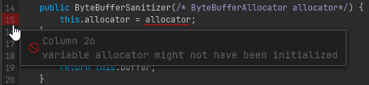
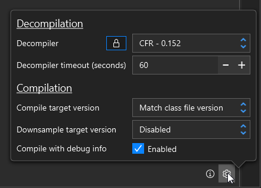

# Recompiling

When working with code that is decompiled cleanly, you can modify that decompiled code then save with `[Control] + [S]` to recompile the class. This works the same as if you were compiling regular Java source code, it uses the same tools but with some additional tooling to make things easier:

1. Classes in the workspace are provided as supporting class-path entries 
2. Classes that are referenced in the current class, but *not found* in the workspace, will be generated where possible
3. Compile errors and warnings are shown in the UI

<figure><figcaption>
A simple example showing a bit of clean up in some utility methods. A successful save is indicated by the green border flash.
</figcaption></figure>

## Features

### Virtual Classpath from the workspace

A common issue seen with Java reverse engineering efforts I've seen is that people will try to decompile *all the classes* and then pass all of them to the Java compiler. The problem with that approach is that if you want to make a change in `Foo` but `Bar` didn't decompile properly you have to go and fix `Bar` first. In Recaf we address this by plugging in our own file manager to the Java compiler interface. The custom file manager provides access to the contents of classes in the workspace. Now the only content you need to address is whatever class you want to make changes in, like `Foo`.

### Generation of missing classes

By default, Recaf will intercept recompile attempts and do a bit of analysis first. Say you're editing an application that depends on some library called `Phoenix`. The application doesn't bundle any classes from `Phoenix` and you also don't have access to the library jar. Even in this scenario that you would normally not be able to compile code in *(since you are missing a required library)* Recaf will try its best to make it possible. 

We have the benefit of knowing both the source code we pass to the compiler, and an existing compiled version of the class. The existing compiled version will have references to classes, fields, and methods of the `Phoenix` library, and we can collect this information to reconstruct classes from the `Phoenix` library. So long as you don't change the decompiled code to reference some other class, field, or method in the library any existing reference to `Phoenix` code will remain intact.

Recaf does have a config property to change this behavior. Instead of happening before each recompile the analysis happens when you load a workspace. Additionally, all classes are used for analysis which can result in more complete generation of the missing `Phoenix` classes. If multiple classes in the application refer to different fields and methods in a single `Phoenix` class then this would generate the missing class with all of them combined. This can be beneficial but does come with the downside of taking longer for larger workspaces.

### Error display

Pretty self explanatory, the errors reported from compilation attempts are visualized back in the UI. You can hover over the red highlighted lines to see what the original error message was. The button in the top right also shows all current errors in the class and lets you quickly jump between them by clicking on them.

<figure><figcaption>
Clicking the top right button displays a list pop-up of all errors in the class.
</figcaption></figure>

<figure><figcaption>
Hovering over a line with an error on it shows the original reported error.
</figcaption></figure>

### Compiler options

You can modify some compiler options passed during recompilation via the gear button in the bottom right. Currently you can change the target compilation version and whether or not to include debug info _(Line numbers, variable names, etc)_.

<figure><figcaption>
The gear button in the bottom right lets you change the target Java version, and also apply post-processing for things like downsampling
</figcaption></figure>

Recaf only can target versions supported by the Java version its being ran with. If you run Recaf with Java 25 _(Released September 2025)_ it will not let you target anything below Java 8 _(Released March 2014)_. That is still a pretty good range for supported versions, but for older classes written in Java 7 or older you will need to use [the assembler](assembler.md).

## Frequent Questions

> I get a red flash when I save, is that bad?

A red flash means there were compiler errors. You need to address any of those before any changes will be accepted.

> But I didn't even change anything yet

Recaf is showing you **decompiled** code of a binary format. This is not the same as the **original source code**. Decompilers *can make mistakes*. For most *"simple"* Java classes the decompiled code will be close enough to the original that it won't matter. But there are always edge cases to consider. If the decompiled output is not perfectly formed Java source code its on you to either fix those mistakes yourself or switch to using [the assembler](assembler.md).

With this in mind, lets say you want to edit a specific method in a class, but there's another method that failed to decompile. If you attempt to recompile the class you are compiling the whole class not just the specific method you edited. Be mindful of the entire contents of classes when recompiling code so that you do not unintentionally introduce behavioral changes from faulty decompiler output.

> Ok I got a green flash! But when I run my program nothing has changed!

Saving only commits the change to the workspace. The workspace is only kept in-memory. Once you made successful changes you need to export the modified application. Use the file menu and select *"Export application"* to write any modifications to disk.

> In the gear button options, what is the difference between target version and downsample target version?

The target version is what the compiler will expect as input and emit as output. Downsampling is optional post-processing which can turn newer Java constructs into older Java ones. This lets you use new language features introduced in a version like Java 17 but output Java 8 compliant class files. If you use new API's introduced in the Java like `list.getFirst()` some helper classes and methods will be inserted into the workspace to bridge any gaps with older legacy API's.

> Can I recompile obfuscated code?

No, don't even try it. It is not worth the effort, just use [the assembler](assembler.md).