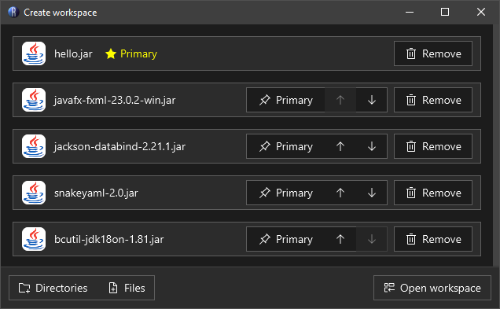
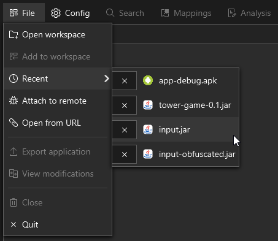
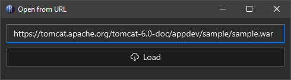
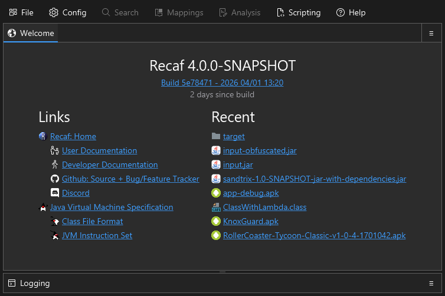

# Loading inputs

You can load input files into Recaf in two ways:

1. The File menu
2. Drag-drop files onto Recaf

## File Menu

The file menu has a few different entries in it

**Open workspace**: Opens a dialog that prompts you to provide files or folders to open.

<figure><figcaption>
The 'Open workspace' dialog lets you choose any number of inputs. Only the primary file will be editable, the rest are treated as supporting libraries and are read-only. Remember to check which one you have selected as primary!
</figcaption></figure>

**Add to workspace**: If you already have a workspace open, you can add supporting libraries with a similar dialog to *"Open workspace"*.

**Recent**: This is a dropdown menu containing recent files you have opened with Recaf. Click on an entry to open it again.

<figure><figcaption>
The 'Recent' menu in the 'File' menu tracks the last few files previously opened in Recaf. You can click on them to open them again.
</figcaption></figure>

**Attach to remote**: Opens a dialog that lists currently running Java processes on your computer. You can select one, then press *"Connect"* to attach to the process and show classes grouped by their classloader.

<figure><figcaption>
The 'Attach to remote' dialog lets you read and modify the classes from any compatible Java process on your local machine. Click a process for more info, and then 'Connect' to load it.
</figcaption></figure>

**Open from URL**: Opens a dialog that lets you put in a URL to a remote file. It will be streamed and loaded in-memory.

<figure><figcaption>
The 'Open from URL' dialog lets you read content from any valid URL you can connect to.
</figcaption></figure>

## Drag-Drop

When you open Recaf you'll see the home panel with relevant links and recent files. This entire space can receive dropped files. If you already have a workspace open, the workspace panel *(tree of all files in the input)* behaves in the same way. Drop files here to open them.

<figure><figcaption>
The home panel provides you with easy access to relevant documentation links, single click links to load recent input files, and current version information.
</figcaption></figure>