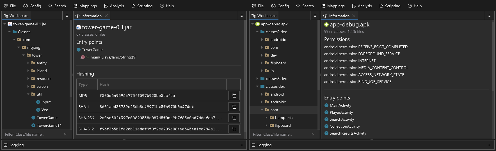

# Summarization

After you load a workspace, Recaf will do some basic analysis of its contents and provide you with a summary of what was found. The kind of information supported includes:

- The number of classes and files
- The entry points
  - For regular jar files, `public static void main(String[] args) { ... }`
  - For Android applications, listed `Activity` subclasses defined in the application manifest
- The required permissions for Android applications
- Indicator for anti-reverse engineering obfuscation patterns
  - Offers a single-click button to remedy the patterns 
- Areas of the application broken down by control flow analysis 
- Hash information of the primary resource
  - The right side buttons copy the hash value to your clipboard. This can be useful if you want to look up files on services like VirusTotal or AnyRun quickly.
- Any jar signature contents such as: RSA/DSA

<figure><figcaption>
Different kinds of files may have different summary content. In this example we have a side-by-side of a regular Java application and an Android application.
</figcaption></figure>