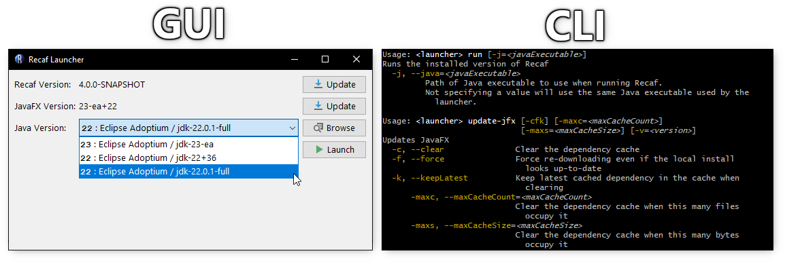
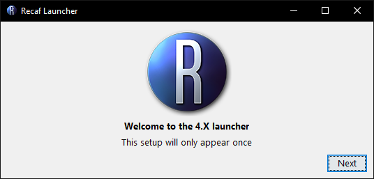
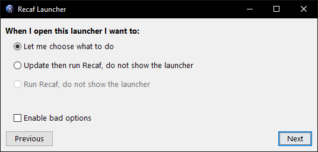
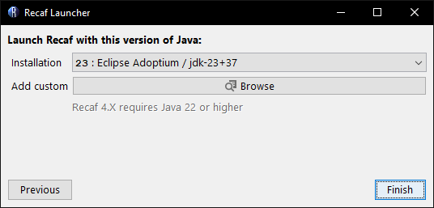

# Installing via the launcher

The latest version of the launcher can be downloaded on the project's [releases page](https://github.com/Col-E/Recaf-Launcher/releases). Each release offers both a GUI and CLI.

<figure><figcaption><p>Screenshot of the launcher GUI and CLI in use side-by-side.</p></figcaption></figure>

## Using the GUI

Run the jar file to open the GUI. The first time using the launcher, you will be asked how this launcher should behave.

<figure><figcaption><p>Welcome screen shown in the launcher the first time you use it.</p></figcaption></figure>

You have the options of:

- Showing the launcher every time
- Updating and running Recaf _(without showing the launcher)_
- Just running Recaf without updating _(and without showing the launcher)_

<figure><figcaption><p>Prompt asking how the launcher should behave on following uses.</p></figcaption></figure>

If you wish to reset the behavior after picking one of the last two options, delete the `%RECAF%/launcher` directory where `%RECAF%` is where Recaf is installed on your system. This location can be different depending on what operating system you use.

| OS      | Location                                          |
| ------- | ------------------------------------------------- |
| Windows | `%APPDATA%/Recaf`                                 |
| Mac     | `$HOME/Library/Application Support/Recaf`         |
| Linux   | `$XDG_CONFIG_HOME/Recaf` or `$HOME/.config/Recaf` |

If you wish to have Recaf installed in a different location set the `RECAF` environment variable to the desired directory path.

<figure><figcaption><p>Prompt asking for a Java installation to use Recaf with.</p></figcaption></figure>

The launcher itself can run with Java 8 or above. It will ask you to pick a version of Java to use for running Recaf that meets the requirements. The launcher will attempt to find existing Java installations on your machine and pre-populate the dropdown menu. If you want to use a different version or the launcher couldn't find where you installed Java you can click the _"browser"_ button to manually pick an installation.

## Using the CLI

The following is the list of CLI commands.

### Auto
- Checks local system compatibility
- Keeps JavaFX up-to-date
- Keeps Recaf up-to-date
- Runs Recaf
```
Usage: <launcher> auto
```

### Run
- Runs the currently installed version of Recaf
```
Usage: <launcher> run
  -j, --java=<javaExecutable>
         Path of Java executable to use when running Recaf.
         Not specifying a value will use the same Java executable used by the
           launcher.
```

### Compatibility
- Checks for a compatible version of Java
- Checks if the current Java runtime includes JavaFX
    - Bundling JavaFX _can_ work, but its your responsibility to ensure the bundled version is compatible with Recaf
    - Ideally use a JDK that does not bundle JavaFX and let the launcher pull in JavaFX
```
Usage: <launcher> compatibility [-ifx] [-ss]
      -ifx, --ignoreBundledFx
         Ignore problems with the local system's bundled JavaFX version
      -ss, --skipSuggestions
         Skip solutions to detected problems
```

### Update Recaf
- Keeps Recaf up-to-date
```
Usage: <launcher> update
```
If you want to be on the bleeding edge of things there is an alternative command:
```
Usage: <launcher> update-ci [-b=<branch>]
Installs the latest artifact from CI
  -b, --branch=<branch>   Branch name to pull from.
                          By default, no branch is used.
                          Whatever is found first on the CI will be grabbed.
```

### Update JavaFX
- Keeps Recaf's local JavaFX cache up-to-date with the current release of JavaFX
- Can be configured to use specific versions of JavaFX if desired
- Can be configured to delete old versions of JavaFX in the cache automatically
```
Usage: <launcher> update-jfx [-cfk] [-maxc=<maxCacheCount>]
                             [-maxs=<maxCacheSize>] [-v=<version>]
  -c, --clear               Clear the dependency cache
  -f, --force               Force re-downloading even if the local install
                              looks up-to-date
  -k, --keepLatest          Keep latest cached dependency in the cache when
                              clearing
      -maxc, --maxCacheCount=<maxCacheCount>
                            Clear the dependency cache when this many files
                              occupy it
      -maxs, --maxCacheSize=<maxCacheSize>
                            Clear the dependency cache when this many bytes
                              occupy it
  -v, --version=<version>   Target JavaFX version to use, instead of whatever
                              is the latest
```

### Check Recaf's version
- Prints out the version of Recaf installed via the launcher
```
Usage: <launcher> version
```