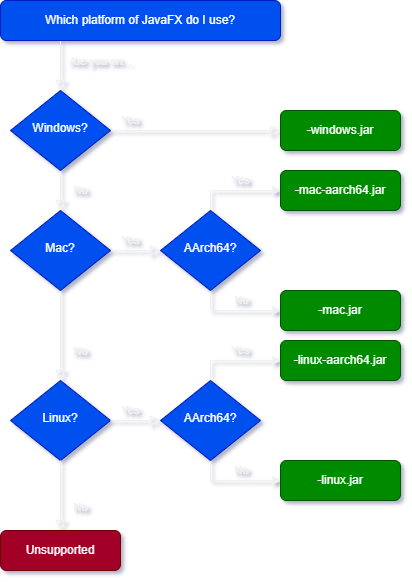

# Installing manually

To install and launch Recaf 4.X without the launcher here's the process to follow:

## Step 1: Download Java 22 or higher

You can get Java 22+ from a variety of vendors. We have a list of recommended vendors in the previous [requirements](requirements.md) page.

## Step 2: Download Recaf

You can grab the official releases from the [GitHub releases](https://github.com/Col-E/Recaf/releases). You will want to pick the larger JAR file with the `-all.jar` suffix as this is the jar file that bundles all transitive dependencies *(Except JavaFX since it is platform specific)*.

If you want to try out features and fixes before they get bundled into a release you can also check the [CI](https://github.com/Col-E/Recaf/actions/workflows/build.yml) for nightly artifacts. You will need to be signed into GitHub to access the artifact downloads though.

For the sake of simplicity the file downloaded in this step will be referred to as `recaf.jar`.

## Step 3: Download JavaFX

You will need to download the four JavaFX artifacts suited for your operating system.

- [javafx-base](https://mvnrepository.com/artifact/org.openjfx/javafx-base)
- [javafx-graphics](https://mvnrepository.com/artifact/org.openjfx/javafx-graphics)
- [javafx-controls](https://mvnrepository.com/artifact/org.openjfx/javafx-controls)
- [javafx-media](https://mvnrepository.com/artifact/org.openjfx/javafx-media)

### How do I get the artifact for my system?

1. Pick a version from the displayed table.
   - This will take you to a page describing information about that specific version of the dependency. 
   - The oldest version we would recommend is `22` or any of its patch version updates _(Like `22.0.1`)_.
   - The newest version you can choose depends on your version of Java installed. JavaFX occasionally updates what version of Java it targets.
     - JFX 21 requires Java 17+
     - JFX 23 requires Java 21+
     - You can check the [JFX release notes](https://github.com/openjdk/jfx/tree/master/doc-files) to see whenever they bump the minimum target JDK version.
2. There will be a row labeled `Files`. Select `View All`. 
   - This will show you the list of each platform-specific release for the given version. 
   - Pick the appropriate platform for your operating system. You can find a flow-chart helper below.
3. Choose `javafx-<name>-<version>-<platform>-<arch>.jar`.
   - This should be one of the larger file variants in the list. 
   - Do this for each of the dependencies in the list above.
4. Put all four artifacts in a directory next to `recaf.jar`.
   - In this example I will name the directory `dependencies`.

**Platform flow-chart:**

<figure><figcaption>
Flow chart/decision tree showing which JFX platform you should pick for your system.
</figcaption></figure>

## Step 4: Run Recaf with JavaFX in the classpath

Run the command `java -cp recaf.jar;dependencies/* software.coley.recaf.Main`.

Additional arguments for Recaf are documented in the [developer "Running" page](../../dev/arch/running.md).