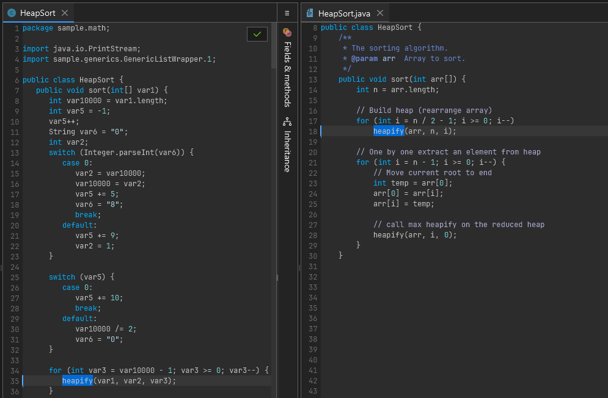

# Obfuscation

If you're using Recaf to inspect suspected malware, or closed source software, you are more than likely going to encounter obfuscation in some form or another. 

<figure><figcaption>
An obfuscated HeapSort algorithm with opaque control flow
</figcaption></figure>

## What is obfuscation?

Simply put, obfuscation is anything that makes it harder to reverse engineer the logic of an application.

## Why do people obfuscate their software?

It depends on who is developing the software and the intended purpose of the software. There are plenty of legitimate reasons to obfuscate software, and also plenty of illegitimate ones.

- Decompiling Java classes with modern decompilers is trivial and generally very accurate. Obfuscation makes it more difficult to recover source code that is easily copy-pastable. It is not foolproof but deters many potential reverse engineers with limited experience.
- A majority of a Java class file is often its constant pool, which includes all the names of referenced classes, fields, and methods. At runtime it is very rare that you need to have this information kept in a meaningful manner *(unless the application uses reflection)*. Some obfuscation can remove or compress this data by renaming these symbols to shorter values, often a single character or two. [ProGuard](https://github.com/Guardsquare/proguard) is a great example of a tool that focuses on this direction of obfuscation.
- Some developers assume that obfuscating their software makes it more secure. There can be *some* truth to this but only in the manner that it slows down bad actors rather than outright preventing them from tampering with the application. If your application has to run on a user's device, that user can, with enough time and knowledge, circumvent any local security measures.
- Malware developers will heavily obfuscate their code to hide malicious behavior. This makes sense at first, but at the same time just brings more suspicion to the application as it is then heavily obfuscated. The main reason why they would do this is to bypass any scan-time detections of anti-malware programs looking for known malware signatures. Again, its a double-edged sword because sometimes anti-malware vendors end up making signatures for the obfuscation itself which leads to any use of the specific obfuscation strategy being flagged even if the application being obfuscated is not malicious in nature.

## How does Recaf handle obfuscation?

Recaf has a number of features dedicated to defeating common obfuscation strategies. Some of them are always active and run in the background, meaning they do not require any user input to utilize. Others will require you to intentionally use them at your own discretion. The following pages in this section will cover different kinds of obfuscation and how different Recaf features can be used to address them.