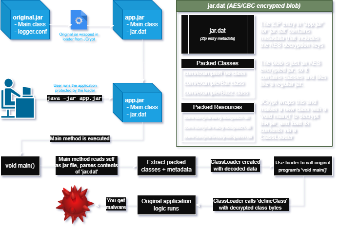

# Loader Obfuscation

Loaders are mechanisms which take binary input data and transform it into loadable classes at runtime. This prevents easy analysis as class files are kept in an arbitrary format and are not immediately viewable.

## Example

[JCrypt](https://github.com/wille/jcrypt) is a rather straight forward implementation of loader obfuscation. The contents that will be executed by the runtime are found in the `stub` directory. Here's  an overview of how it works:

<figure><figcaption>
A diagram outlining the control flow of how JCrypt operates.
</figcaption></figure>

## Dumping loaders statically

Recaf will not automatically unpack the loader for you. There are too many patterns to match to make this a fully automated process, but the general approach is simple.

1. Find where the packed data is loaded. 
    - Usually you will see a call to `getResource("jar.dat")` or `getResourceAsStream("jar.dat")`
    - Or finding the current running jar and reading its contents like with JCrypt. Generally done via `getProtectionDomain().getCodeSource().getLocation()` on a class in the loader which provides the URI to where the class was loaded from.
2. Find where the packed data is decrypted.
3. Find where the decrypted data is used in a `ClassLoader`
    - Classes in this context are generally loaded via `defineClass(name, bytes, 0, bytes.length)`
4. Copy the code necessary to load the packed data, decrypt it, then instead of using `defineClass` write the contents to disk.
    - Run your modified version that saves the decrypted classes and resources to disk. 

Once you've written the decrypted classes to disk, you can open them back up in Recaf.

## Dumping loaders dynamically

The other option to dump loader contents is to run the application and then use [instrumentation](https://www.baeldung.com/java-instrumentation) or [JVMTI](https://docs.oracle.com/javase/8/docs/technotes/guides/jvmti/) to dump the loaded classes. Some considerations before you take this approach:

1. You will generally do this in a [Virtual Machine](https://www.virtualbox.org/) and not your host system.
2. When you dump the classes, you are only able to dump what is *currently loaded*. If there are unloaded classes in the packed data that have not been referenced yet, those will not be included in the dumped output.

Example dumping agents:

- [Java Instrumentation based agent](https://github.com/accessmodifier364/Dumper)
- [C++ JVMTI based agent](https://github.com/therathatter/jintercept) _(Requires building it yourself to target your current machine architecture)_
  - [Black magic JVMTI from Java-side](https://github.com/jumanji144/klass) _(Requires building yourself, setting up usage in target VM to dump)_

