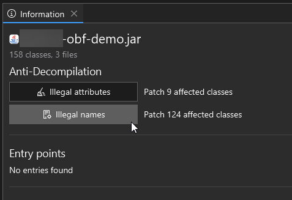
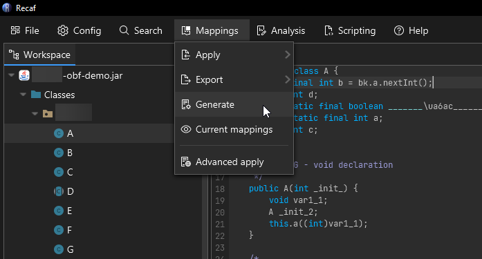
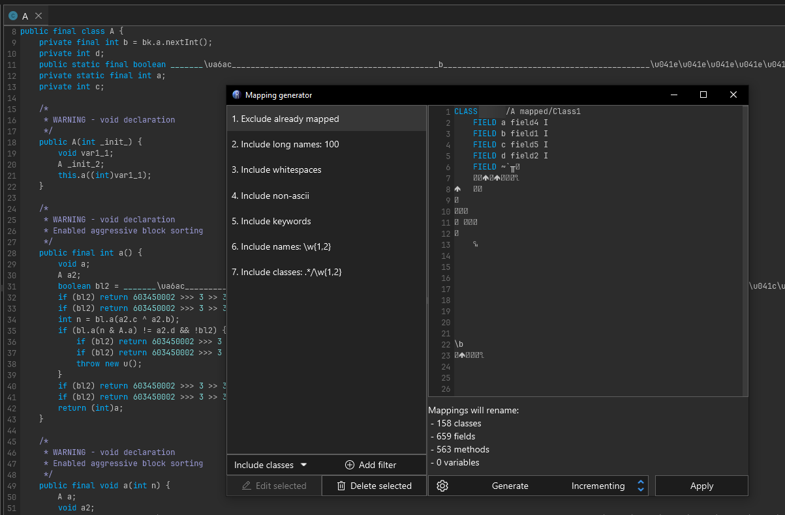
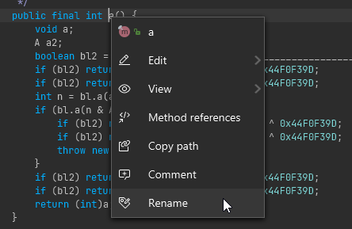
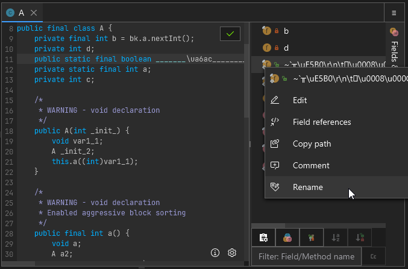
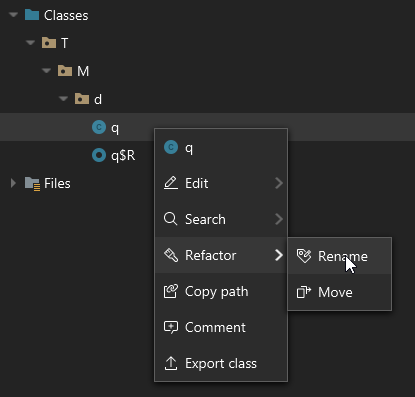
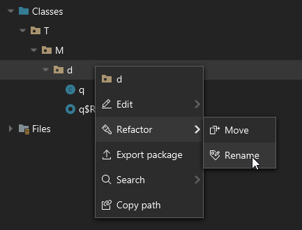

# Name Obfuscation

Obfuscation that changes the names of classes, fields, and methods is commonly referred to as name obfuscation, or identifier renaming. There are plenty of different ways to name things that cause reverse engineering to be more challenging.

## Limitations of name obfuscation

[JVMS 4.2](https://docs.oracle.com/javase/specs/jvms/se20/html/jvms-4.html#jvms-4.2) defines what characters are not allowed to appear in different kinds of names.

> Class and interface names that appear in class file structures are always represented in a fully qualified form known as binary names. For historical reasons, the syntax of binary names that appear in class file structures differs from the syntax of binary names documented in JLS §13.1. In this internal form, the ASCII periods (`.`) that normally separate the identifiers which make up the binary name are replaced by ASCII forward slashes (`/`). The identifiers themselves must be unqualified names.
>
> Names of methods, fields, local variables, and formal parameters are stored as unqualified names. An unqualified name must contain at least one Unicode code point and must not contain any of the ASCII characters `. ; [ /` _(that is, period or semicolon or left square bracket or forward slash)_. 
>
> Method names are further constrained so that, with the exception of the special method names `<init>` and `<clinit>`, they must not contain the ASCII characters `<` or `>` _(that is, left angle bracket or right angle bracket)_. 

Aside from these few restrictions, the sky is the limit.

## Examples

The following name obfuscation strategies will target this basic data model class:

```java
public class User {
    private String username;
    private int userId;

    public User(String username, int userId) {
        this.username = username;
        this.userId = userId;
    }

    public void displayUserInfo() {
        System.out.println("User: " + username + ", ID: " + userId);
    }

    public static void main(String[] args) {
        User user = new User("Alice", 12345);
        user.displayUserInfo();
    }
}
```

### Short & overloaded naming

Obfuscators like [ProGuard](https://github.com/Guardsquare/proguard) will rename as many things as possible to the same short names. This has two main benefits.

1. It makes it difficult to determine what is being referred to when looking at decompiler output since things are only referred to by name.
2. It saves space in the constant pool, which makes the class file smaller. Instead of having five separate entries for `User`, `username`, `userId`, `user`, and `displayUserInfo` you now only have one entry for `a`.

```java
// User --> a
public class a {
	// username + userId --> a
	// As long as the types of multiple fields are unique, they can share the same name
    private String a;
    private int a;

	// Parameters & local variables can be named anything 
	// since they are debugger metadata not required for much else at runtime.
    public a(String a, int a) {
    	// Because the types are unique, but names are shared its impossible to tell what is
    	// assigned to what here just by looking at decompiler output
        this.a = a;
        this.a = a;
    }

    public void a() {
    	// If you're lucky the decompiler will hint which field is referenced in ambiguous cases
    	// by casting to the field's type.
        System.out.println("User: " + (String) a + ", ID: " + (int) a);
    }

    public static void main(String[] a) {
        a a = new a("Alice", 12345);
        a.a();
    }
}
```

### Reserved keyword naming

Identifiers can be mapped to reserved keywords such as primitives (`int`, `float`, etc), access modifiers (`private`, `public`, etc) and other language features such as `switch`, `for`, etc. This is generally annoying as it messes with syntax highlighting of tools and confuses Java source code parsers.

> Note: In this case, all identifiers are given unique keywords, but the same principle as discussed before can be applied. You could very well name every identifier in the example `void` like how the prior example named every identifier `a`.

```java
public class void {
    private String float;
    private int int;

    public void(String short, int byte) {
        this.float = short;
        this.int = byte;
    }

    public void long() {
        System.out.println("User: " + float + ", ID: " + int);
    }

    public static void main(String[] private) {
        void char = new void("Alice", 12345);
        char.long();
    }
}
```

### I and L naming

The letters `I` and `l` in some font families look very similar. Some obfuscators take advantage of this by naming identifiers with a series of `I` and `l` in the hopes that all identifiers visually look identical. For instance:

- `IIlII`
- `IlIIl`
- `lIIlI`

With a good font, these will be easily identifiable as separate names.

```java
public class IIlII {
    private String IlIIl;
    private int lIIlI;

    public IIlII(String IlIIl, int lIIlI) {
        this.IlIIl = IlIIl;
        this.lIIlI = lIIlI;
    }

    public void IIIlI() {
        System.out.println("User: " + IlIIl + ", ID: " + lIIlI);
    }

    public static void main(String[] IIIII) {
        IIlII llIll = new IIlII("Alice", 12345);
        llIll.IIIlI();
    }
}
```

### Empty space naming

There are plenty of unicode letters that look like empty spaces. Combining several of these together will let an obfuscator make classes look largely empty.

```java
public class  {
    private String ;
    private int ;

    public (String , int ) {
        this. = ;
        this. = ;
    }

    public void () {
        System.out.println("User: " +  + ", ID: " + );
    }

    public static void main(String[] ) {
          = new ("Alice", 12345);
        .();
    }
}
```

### Windows reserved naming

Name a class `CON` in any variation of capitalization on a Windows computer and see what happens.

## Cleaning up names with Recaf

Recaf has multiple ways to clean up name obfuscation. There's automated processes like the mapping generator and applying obfuscation mappings, and then there's manual renaming where you rename items yourself one at a time.

### Automatic rule based renaming

When you first open a workspace Recaf does some analysis of the classes within it. If any classes with illegal names *(see reserved keywords, whitespace naming above)* the option to automatically rename those cases appears in the workspace summary/information display. Clicking the *"Illegal names"* button under *"Anti-Decompilation"* will open the mapping generator with the illegal names already pre-populated. You can hit *"Apply"* to automatically rename the listed classes, fields, and methods.

<figure><figcaption><p>Recaf's workspace summary that displays when opening a file allows you to rename illegal identifiers with a single click</p></figcaption></figure>

You can also open the mapping generator at any time by selecting *'Mapping > Generate'* in the menu bar.

<figure><figcaption><p>The mapping generator is accessed from 'Mappings > Generate'</p></figcaption></figure>

The mapping generator allows you to specify a series of rules for names to include and exclude. The following is an example that generally would cover most name obfuscation covered in this page:

- Include long names: 100
  - Reason: Most class names *(including the package name)* aren't actually that long, unless you're looking at something like [FizzBuzz Enterprise](https://github.com/EnterpriseQualityCoding/FizzBuzzEnterpriseEdition) or obfuscated code that makes very long names.
- Include whitespaces
  - Reason: Its impossible for unobfuscated code coming from Java source code to have whitespace characters in names. If any name has whitespace it is certainly something added through obfuscation.
- Include non-ascii
  - Reason: Its generally rare to see non-ascii characters in Java source. Its not impossible but given the rarity and how frequent obfuscators tend to use random high codepoint characters for their names, its generally a useful filter to include.
- Include keywords
  - Reason: Its impossible for unobfuscated code coming from Java source code to have class, field, or method names that are exact matches of reserved keywords.If any name equals a reserved keyword then it is certainly something added through obfuscation.
- Include names: Matches `\w{1,2}`
  - Reason: This is a regex that matches word *(`\w`)* characters 1 or 2 times. The idea is to match short names that you would see in a common ProGuard config.
- Include classes: Matches `.*/\w{1,2}`
  - Reason: This is a regex that matches any text up to a package separator *(`.*/`)*  and then word *(`\w`)* characters 1 or 2 times. The idea is to match short names that you would see in a common ProGuard config, but for classes in any package.

<figure><p>The mapping generator will generically name classes, fields, and methods that match user-provided filters</p></figcaption></figure>

### Manual renaming

Interacting with classes, fields, and methods allows you to rename them. When viewing decompiled code, rename on the name of the declared item. If the context can be resolved a context menu will appear and within this menu is the option to *"Rename"*. 

You can also rename classes, fields, and methods via `Alt + R` when the caret is on the declared item's name. This relies on the same context resolution, but allows you to rename items without using the mouse.

<figure><figcaption><p>Right clicking on a class, field, or method will allow you to rename it</p></figcaption></figure>

When context resolution fails *(which will happen in some forms of obfuscated code)* you can interact with fields and methods via the side panel aptly named *"Fields & Methods"*. In this sample I there is a field which is named a bunch of random characters, some which are not valid identifier characters. In this case the only way to interact with this field in the decompiler view is through this side menu.

<figure><figcaption><p>On the right side of a decompiled class, you can also right click on fields and members in this list</p></figcaption></figure>

Classes in the workspace tree can also be interacted with. Right clicking on them, or using the keybind `Alt + R` will allow you to rename them.

<figure><figcaption><p>Right clicking on classes in the workspace tree also allows you to rename them</p></figcaption></figure>

Classes can alternatively be moved. Moving differs slightly from renaming, it allows you to select a package in the workspace to move the class into. Technically at the end of the day it is still renaming, but the UX is more like what you would expect from the move operation in an IDE like IntelliJ.

<figure><figcaption><p>Right clicking on packages lets you rename whole packages at a time</p></figcaption></figure>
