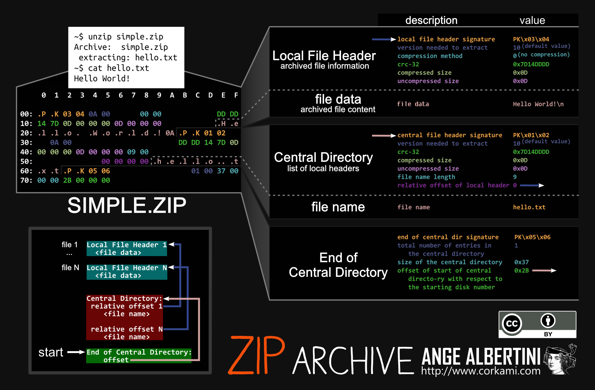
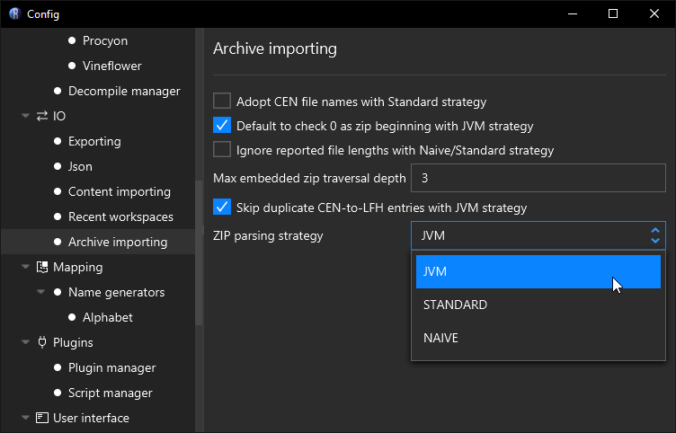

# Jar / Zip Obfuscation

[Jar files](https://docs.oracle.com/javase/8/docs/technotes/guides/jar/jar.html) are [Zip files](https://en.wikipedia.org/wiki/ZIP_(file_format)) with the only major difference being the expectation of special paths like contents in the `META-INF` folder and location of `.class` files matching the class's name. This is at least the only major difference on paper. In practice the JVM has multiple ways it will parse Jar and Zip files. Here are a few of them:

1. `java -jar example.jar`
2. `ZipFile zip = new ZipFile(new File("example.jar"));`
3. `ZipInputStream zis = new ZipInputStream(new FileInputStream(new File("example.jar")));`
4. `FileSystem zipFs = FileSystems.newFileSystem(Paths.get("example.jar"))`

Each of these cases uses a different backend for parsing Jar/Zip files. This allows obfuscators to abuse the [Zip file format](https://pkware.cachefly.net/webdocs/casestudies/APPNOTE.TXT) in different ways for each case. To illustrate the problem lets first take a very high-level look at how a Zip file is *usually* structured.

<figure><figcaption>
A diagram by <a href="https://github.com/corkami/pics">Ange Albertini</a> breaking down a small Zip file containing a single text file.
</figcaption></figure>

Zip files generally begin with `50 4B 03 04` *(Ascii `PK..`)* since this is the header signature of a *"Local File Header"*. These local file headers are where the contents of compressed files in the zip are defined *(See "file data")*. Going forward in the file you will see the *"Central Directory"* which has almost identical values to the *"Local File Header"*. Then last section is the *"End of Central Directory"*. Central directories, as described in the graphic, list the available local file headers that are present further to the start of a file. The end of the central directory outlines where these central directory entries begin in the file, and how many of them there are. Zip files are intended to be read backwards. You read the end of the central directory, scan backwards to collect the central directories, and that should give you all the information you need to understand what is contained in the Zip file.

Central directories and local file headers have a lot of the same fields. As described before, the central directories are all you need to understand what is in the Zip file, so the local file header values *should* match. However in the realm of obfuscation the intended purposes of these structures are thrown out of the window.

## Examples of Jar / Zip obfuscation

For the following cases consider experimenting on your own with the following samples:

-  [hello.jar](../../assets/hello.jar) 
-  [hello-trailing-slash.jar](../../assets/hello-trailing-slash.jar) 
-  [hello-trailing-slash-0-length-locals.jar](../../assets/hello-trailing-slash-0-length-locals.jar) 
-  [hello-deceptive.jar](../../assets/hello-deceptive.jar) 

### Obfuscated `java -jar` cases

When you use `java -jar example.jar` to run an application, the JVM is using [libzip](https://github.com/openjdk/jdk/tree/6701eba736ac51db4b0d0d7db6c7bdd4ae8a1c16/src/java.base/share/native/libzip). This implementation reads the Jar file backwards, as intended by the Zip file format. When a *"Central Directory"* defines a value that is also replicated by the *"Local File Header"*, the *"Central Directory"* version is always preferred, meaning the *"Local File Header"* can be filled with mostly junk. This however is not strictly the case for the *"compressed size"* fields. Neither the *"Local File Header"* or "Central Directory"* are trusted for the size. The JVM libzip implementation scans from the where the file data is supposed to begin, up to the `PK..` header of the next available Zip entry. This means both the local and central values can be something like `0` which makes the file appear empty, but executes fine at runtime. Also, if a class's file name ends with a trailing `/` that gets silently dropped. This fools most zip tools into displaying the file *(because it has all the bytes of the class file)* as a folder instead.

So to summarize:

- Class files can have contradictory data between the *"Local File Header"* and *"Central Directory"* entries
- Class files can have bogus values for their *"(un)compressed size"* fields
- Class files can have bogus values for their CRC fields
- Class files can appear as directories by ending their zip file entry path with `/`
- Jar files can have leading junk bytes in front of them, such as an image or executable making it a polygot

<figure><figcaption>
Download this image and run <code>java -jar hello.png</code>
</figcaption></figure>

### Obfuscated `ZipFile` cases

The implementation of `ZipFile` used to be largely implemented by libzip back in [Java 8](https://github.com/openjdk/jdk8u/blob/master/jdk/src/share/classes/java/util/zip/ZipFile.java), but has rewritten in [Java 9](https://github.com/openjdk/jdk9u/blob/master/jdk/src/java.base/share/classes/java/util/zip/ZipFile.java) to be implemented fully in Java per [JDK-8145260](https://bugs.openjdk.org/browse/JDK-8145260). It retains most of the same behaviors due to the nature of this rewrite being a port, but has a few minor differences.

- Trailing slashes in class file path names results in `ZipEntry.isDirectory()` being `true` which will trick many applications into skipping them.

### Obfuscated `ZipInputStream` cases

Streaming a Jar/Zip file will read from the front. This adds the following conditions:

- The file cannot have any leading junk bytes. It must start with a *"Local File Header"*
- The fields of the *"Local File Header"* must be correct, for instance the *"(un)compressed size"* and *"CRC"* values must be valid for the data held by the *"file data"* field.

### Obfuscated `FileSystem` cases

Passing a `Path` to a Jar/Zip file when creating a `FileSystem` leads to yet another custom implementation of Zip file parsing. However, it is mostly the same as `ZipFile` in terms of behavior. The main key difference is that it skips entries where `ZipEntry.isDirectory()` is `true` which can lead to skipping over valid class files.

## Parsing Jar / Zip files with Recaf

Recaf by default will read Jar/Zip files as if you are reading them via `java -jar` but this behavior is configurable in the `Archive importing` section of the config window. The most important value to change is the parsing strategy where:

- *"JVM "* mirrors `java -jar` mechanics
- *"Standard"* mirrors `ZipFile` mechanics - but scanning forward from the start of the file rather than backwards
- *"Naïve"* mirrors `ZipInputStream` mechanics 

<figure><figcaption>
Recaf's archive importing config allows you to change how Jar/Zip files are read
</figcaption></figure>

| Option                                                    | Description                                                  |
| --------------------------------------------------------- | ------------------------------------------------------------ |
| Adopt CEN file names with Standard Strategy               | Standard strategy uses names in the *"Local File Header"* by default, enabling this will use names specified in the *"Central Directory"* instead. |
| Default to check 0 as zip beginning with JVM strategy     | Enabling this allows the JVM strategy to skip some edge case checks when dealing with Jar/Zip files that have multiple Jar/Zip files concatenated together, or embedded in one another. This is enabled by default for a slight performance gain. |
| Ignore reported file lengths with Naïve/Standard strategy | Enabling this will change how the *"file data"* of *"Local File Header"* entries are read with Naïve and Standard strategies. By default they trust the *"compressed size"* field. This changes them to mirror the JVM strategy, where the lengths are interpreted by scanning to the next zip file entry in the file. |
| Max embedded zip traversal depth                          | Many applications will bundle other Jar/Zip files within themselves. Recaf will display the contents of embedded jars in the workspace tree in the *"Embedded"* category. It will continue to do this for the number of given levels here. The default value is `3` as most standard applications do not go beyond this level. |
| Skip duplicate CEN-to-LFG entries with JVM strategy       | Some obfuscated Jar/Zip files will have multiple *"Central Directory"* entries point to the same *"Local File Header"* to make extraction tools extract the same file many times over. This option checks if a *"Local File Header"* has been parsed already and skips adding duplicate entries to the workspace when enabled. |
| Zip parsing strategy                                      | As outlined above, the strategy selected determines which use case the Jar/Zip is intended to be read with. Most of the time you are generally going to want to stick with the JVM strategy, unless there are no *"Central Directory"* entries, which then you will need to use the Naïve strategy. |

